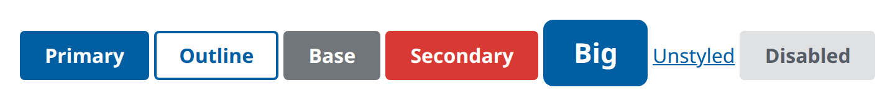
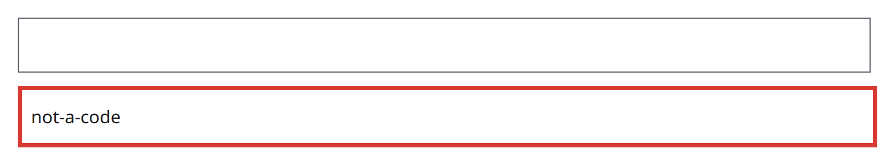
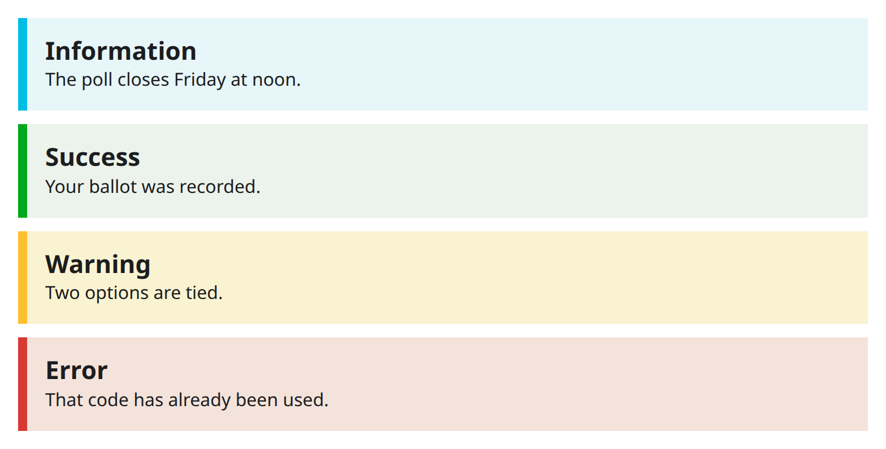
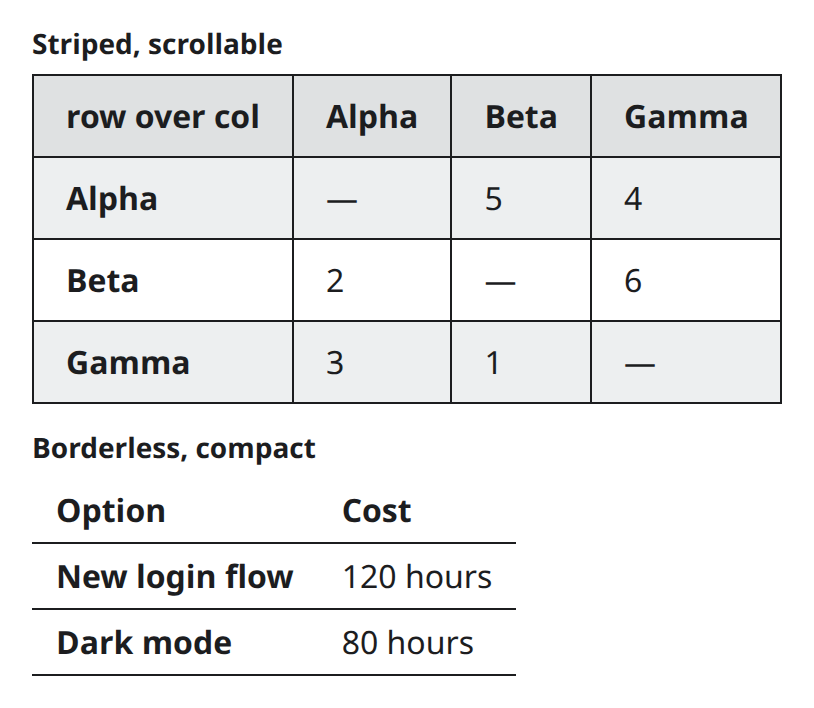
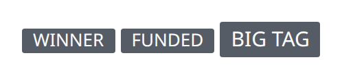
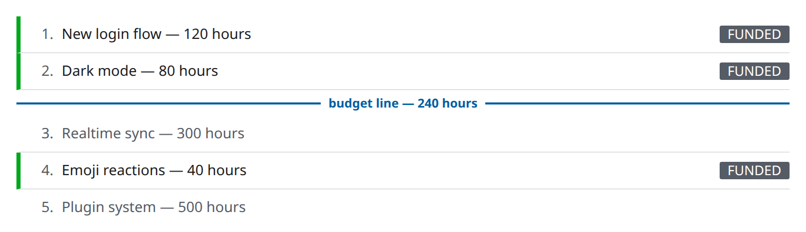
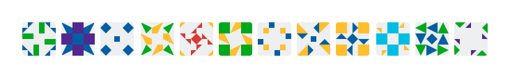

# uswds-gsx-registry

[USWDS](https://designsystem.digital.gov)-flavored components for
[gsx](https://github.com/gsxhq/gsx), distributed
[gsxui](https://github.com/gsxhq/gsxui)-style — copy-in, type-checked,
server-rendered, zero dependency on the `uswds` npm package.

Components carry real `usa-*` classes; the styles ship as plain CSS written
against `--usa-*` design-token custom properties. Every color reads a
shadcn-style semantic token first and falls back to the authentic USWDS
primitive, so a bare project renders stock USWDS and a themed gsxui project
(including dark-mode re-grades) restyles the components automatically.

## Install

In a gsxui-initialized Go module (the CLI reads your `gsxui.json`):

    go run github.com/gavmor/uswds-gsx-registry/cmd/uswds-gsx@latest add button input alert
    go run github.com/gavmor/uswds-gsx-registry/cmd/uswds-gsx@latest list

This vendors `.gsx` sources into `<ui>/uswds/` (their own `uswds` package —
no collisions with your gsxui components), the two stylesheets into
`<cssdir>/uswds/`, and runs `gsx generate`. Then add to the top of your CSS
entry point:

    @import "./uswds/uswds-tokens.css";
    @import "./uswds/uswds-components.css";

and use them beside your gsxui components:

    import "yourmodule/ui/uswds"

    <uswds.Button type="submit">Sign</uswds.Button>
    <uswds.Button variant="outline" href="/about">About</uswds.Button>
    <uswds.Input name="email" type="email"/>
    <uswds.Alert variant="warning">
        <uswds.AlertHeading>Heads up</uswds.AlertHeading>
        <uswds.AlertText>This form closes Friday.</uswds.AlertText>
    </uswds.Alert>

## Components

| Component | USWDS anatomy | Variants |
|---|---|---|
| `Button` | `usa-button` | `""` (primary), `outline`, `base`, `secondary`*, `big`, `unstyled` |
| `Input` | `usa-input` | — (`aria-invalid` styles the error state) |
| `Alert` (+`AlertHeading`, `AlertText`) | `usa-alert`, no-icon anatomy | `info` (default), `success`, `warning`, `error` |
| `Table` | `usa-table` (+ scrollable container) | `""` (bordered), `striped`, `borderless`; `compact` and `scrollable` stack with any |
| `Tag` | `usa-tag` | `big` |
| `RankedList` | `usa-ranked-list` † | per-item `success` status bar and `muted` ink; labeled waterline cutoff |
| `Identicon` | `usa-identicon` † | — (deterministic per seed; palette `--identicon-1..6`) |

\* USWDS "secondary" is the **red** secondary palette, not a quiet gray —
use `base` or `outline` for a subdued button.

† Registry extension: no upstream USWDS component exists, so the anatomy
is ours — built from USWDS parts (the alert's status bar, list geometry)
entirely on the same `--usa-*` tokens and naming conventions.

Every screenshot below is the component rendered in isolation on stock
USWDS tokens (no theme overrides) — regenerate them with the harness
described under [Development](#development).

### Button

### Input

The bare `usa-input`; `aria-invalid="true"` styles the error state.

### Alert

### Table

`Table` has no per-cell subcomponents — USWDS styles by descendant
selector, so you write plain `<thead>`/`<tbody>`/`<tr>`/`<th>`/`<td>`
(and an optional `<caption>`) as children:

    <uswds.Table variant="striped" compact={true} scrollable={false}>
        <thead><tr><th scope="col">Option</th><th scope="col">Cost</th></tr></thead>
        <tbody><tr><th scope="row">Alpha</th><td>120</td></tr></tbody>
    </uswds.Table>

### Tag

### RankedList

`RankedList` renders a numbered standing — Schulze results, leaderboards,
priority queues — with an optional waterline marking where a cutoff falls
(a budget line, a pass mark, the top-N fold). The line is an index, not an
item property, because a greedy budget walk can still fund a cheap item
below it:

    <uswds.RankedList
        items={[]uswds.RankedItem{
            {Body: gsx.Text("Alpha"), Status: "success", Trailing: uswds.Tag(false, gsx.Text("Funded"), nil)},
            {Body: gsx.Text("Beta"), Muted: true},
        }}
        waterline={1}
        waterlineLabel="budget line — 200 hours"
    />

### Identicon

`Identicon` is a zero-JS, zero-image deterministic glyph (qidenticon
anatomy) for anchoring list rows to opaque IDs — the same seed always
draws the same face:

    <uswds.Identicon seed={voterID}/>

## Design contract

- **You own the code.** `add` copies source into your tree; edit freely.
  A locally modified file is never overwritten without `--overwrite`.
- **Cascade position:** all component CSS sits in `@layer components`.
  Tailwind v4 orders `theme < base < components < utilities`, so your
  utility classes win per property — same contract as gsxui's components.
- **Tokens:** `uswds-tokens.css` is the canonical `--usa-*` primitive set
  (verbatim USWDS values). If your project already defines them, import
  exactly one source.
- **No JS.** Nothing here needs behavior; gsxui's runtime is untouched.

## Development

`.gsx` sources live in `ui/`; committed `.x.go` files keep the module
`go build`-able (consumers regenerate with their own gsx toolchain and
class merger on `add`). Regenerate here with `go tool gsx generate`.

The README screenshots come from `docs/harness`, which renders each
component in isolation on stock tokens:

    go run ./docs/harness -out /tmp/uswds-iso

Screenshot each emitted page at an 800px-wide viewport (2× scale) and
replace the images in `docs/screenshots/`.
